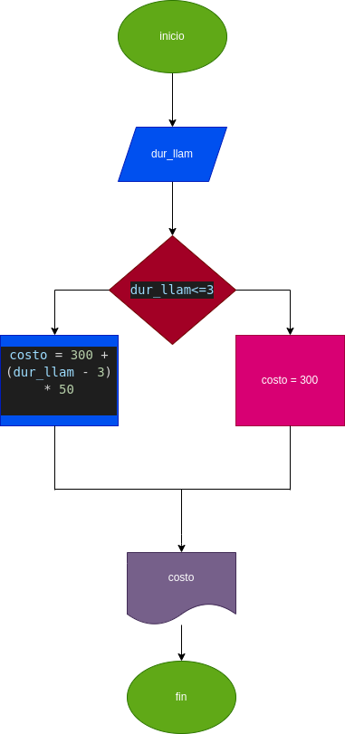

# llamada_telefonica
Programa para calcular el costo de una llamada telefónica

Ingresar el tiempo de duración de una llamada telefónica y determinar la cantidad a pagar, de acuerdo con lo siguiente: 
- Toda llamada que dure 3 minutos o menos tiene un costo de 300 pesos
- Cada minuto adicional cuesta 50 pesos

# Diagrama de flujo
